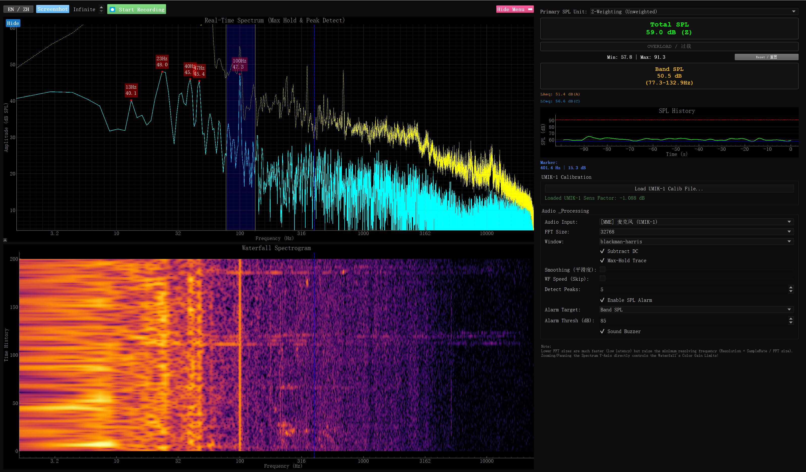
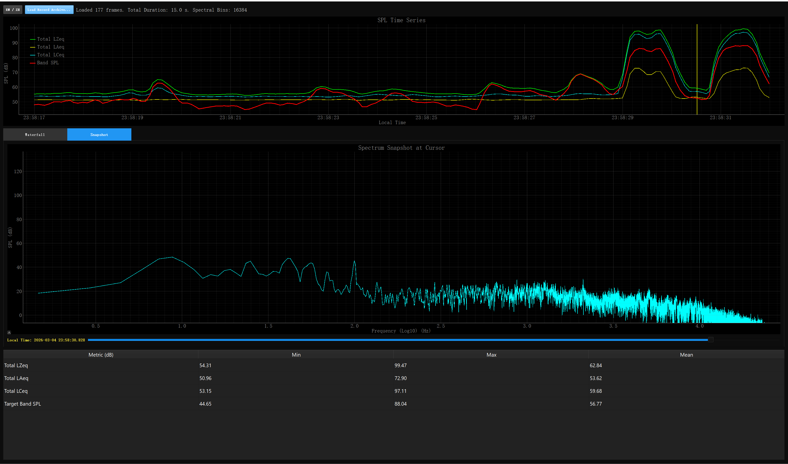

# UMIK-1 Spectrum Analyzer


**UMIK-1 Spectrum Analyzer** is a high-performance, real-time audio spectrum analysis software developed in Python. It is specifically tailored for hardware like the **miniDSP UMIK-1** calibrated measurement microphone, bringing enterprise-level acoustic engineering capabilities directly to your desktop.


> [!WARNING]
> **Disclaimer:** 
> This software is strictly intended for **learning, educational purposes, and hobbyist exploration** only. It is not a certified acoustic measurement device. The DSP implementations are not calibrated against national or international metrology standards. **Do not use this application for any formal, legal, or commercial real-world acoustic compliance measurements.**

---

## 📸 Screenshots

**Real-Time Spectrum Analyzer** — FFT line graph with Max-Hold trace, Peak detection, Waterfall Spectrogram, and SPL readouts:



**Offline Data Viewer** — SPL time-series playback with spectrum snapshot at cursor and statistical summary table:



---

## ⚡ Key Features

* **High-RES FFT Line Analysis**: Adjustable FFT block sizes (practical limit ~65536 given the UMIK-1's 48kHz sample rate) to achieve sub-1Hz resolution. Note that extremely high FFT sizes will reduce UI responsiveness.
* **IEC Standard 1/3 Octave Analysis**: Single-click toggle from raw continuous FFT to coarse professional 1/3 Octave Band Bar Graphs. 
* **Dynamic Peak & Max Hold**: Automatically detects dominant peaks and sticks a Max-Hold trace (both smoothly mapping to Continuous FFT tracks or snapping to Octave Bands).
* **Multi-Weighting SPL Calculation**: Native math implementation of Z-Weighting (Unweighted), A-Weighting (Human Ear Response), and C-Weighting (Loud Machinery Response).
* **Target Band SPL Selector**: Fully draggable `LinearRegionItem` boundaries that calculates the energetic SPL isolated strictly within your selected frequency region. Smooth snapping support for Octave bands.
* **Interactive Waterfall Spectrogram**: Time-series decimation rendering. Translates raw volume dynamics into color history to observe wave decays and resonance.
* **Overload, Clipping & SPL Alarms**: Native OS-level thread beep capability alongside flashing UI visual alerts in case the acoustic energy overloads safe levels. 
* **Native miniDSP UMIK-1 Calibration Support**: Direct parsing of `.txt` calibration files to correct frequency responses dynamically in software.
* **Continuous Measurement Recording**: Output full `.npz` binary array datasets or standard `.csv` files for deep-dive offline acoustics research.
* **Standalone Data Playback Viewer**: Comes bundled with `umik1_data_viewer.py` to graph past recordings, calculate acoustic statistics (Leq, Lmin, Lmax), and seamlessly plot offline Time/Freq curves without re-activating the microphone!

---

## 🛠️ Installation & Setup

### Pre-compiled Standalone Executable (Windows)
The easiest way to use the analyzer without installing Python or dependencies is to download the bundled application:
1. Navigate to the [Releases](https://github.com/RealSeaberry/umik-1-analyzer/releases) tab on this GitHub repository.
2. Download the latest `UMIK_1_Spectrum_Analyzer.zip` from the `dist/` release assets.
3. Extract the folder and run `UMIK_1_Spectrum_Analyzer.exe`. No installation required!

### Python Environment (For Developers)

We recommend using `conda` to sandbox the GUI toolkit dependencies and reduce unnecessary package bloating:

```bash
# 1. Create a specialized environment
conda create -n umik_pack python=3.12
conda activate umik_pack

# 2. Install High-Performance Acoustic & GUI Packages
pip install numpy scipy sounddevice pyqt5 pyqtgraph

# 3. Clone this repository
git clone https://github.com/RealSeaberry/umik-1-analyzer.git
cd umik-1-analyzer
```

*(Optional) If you want to bundle it into a standalone Windows `.exe` executable without forcing users to install Python, `PyInstaller` is natively supported:*
```bash
$env:PYTHONNOUSERSITE = "1"; python -m PyInstaller --noconfirm --clean --onedir --windowed --name "UMIK_1_Spectrum_Analyzer" "umik1_analyzer.py"
```

---

## 🚀 Usage

After activating your Python environment, execute the main GUI entry code:

```bash
python umik1_analyzer.py
```

### GUI Tool interactions:
1. **Device Selection**: Ensure your target measurement mic (e.g. `UMIK-1`) is selected in the bottom right corner.
2. **Axis Rescaling**: 
   - Dragging the bottom X-axis manually repositions the frequency rendering view.
   - Right-Click-Dragging the Y-axis zooms the Amplitude scale. **Note:** Zooming the Spectrum Amplitude directly controls the *Color Gain Levels* of the Waterfall Plot!
3. **Crosshair Tracking**: Clicking anywhere on the Main Spectrum will snap a green crosshair line precisely to measure frequency and dBSPL.
   * *Pro Tip*: If you are in **1/3 Octave** mode, the crosshair automatically smartly snaps directly to the nearest exact IEC center-frequency (e.g 1000.0Hz)!
4. **Recording**: Click the `[⏺ Start Recording]` to drop `.npz` packages into your active directory containing exhaustive full spectrum history data slices. 

*To review your exported recordings in a playback view:*
```bash
python umik1_data_viewer.py
```

---

## 📐 Scientific DSP Principles

Unlike typical colorful "Music Player Audio Visualizers", **UMIK-1 Spectrum Analyzer** maps exact Sound Pressure Levels targeting scientific-grade measurement applications. 

#### 1. Real-Time Math Pipeline
* Audio frames are extracted directly via C-bindings using PortAudio (`sounddevice`).
* Depending on your "Windowing" function (Hanning, Blackman-Harris), the raw chunk undergoes structural attenuation. We mathematically calculate a **coherent gain compensation factor** (`window.sum()`) to guarantee amplitude magnitudes remain 100% truthful irrespective to the window style altering the time-domain leakage.
* The absolute dBFS is mapped algorithmically using `20 * log10(magnitude / normalization)`. 

#### 2. Calibration Integration
* Without a calibration file, the app defines 0.0 dBFS against internal constants and performs basic Flat-Z curve rendering. 
* By attaching your UMIK-1 calibration `.txt`, the script conducts a 1D linear interpolation mapped directly upon the dynamic FFT Bins. Every FFT discrete sample is amplified or attenuated by its exact offset before arriving at your screen. 

#### 3. IEC 1/3 Octave Calculation
When switching onto Professional Octave Analysis, looking at 2000 individual FFT lines is dizzying. We resolve the standard mathematical bins base 10 algorithm (`f_center * 10^(1/20)` boundaries) and compute energetic summative logs `10 * log10(sum( 10^(powers/10) ))` from raw FFT blocks to ensure true band-limited decibel representation.

#### 4. ISO A / C Weighting Calculation
* **Z-Weighting (Flat)** reports the true acoustic pressure displacement in the air. This often results in "noisy" visually tilted pink-noise floors due to the immense scale of atmospheric infrasound.
* The script implements exact $s$-domain transfer function approximations mapped into identical Z-plane counterparts to accurately apply the A-Weighting (Deaf to extreme Lows/Highs) or C-Weighting curves across the calculated spectral energy field.

---
